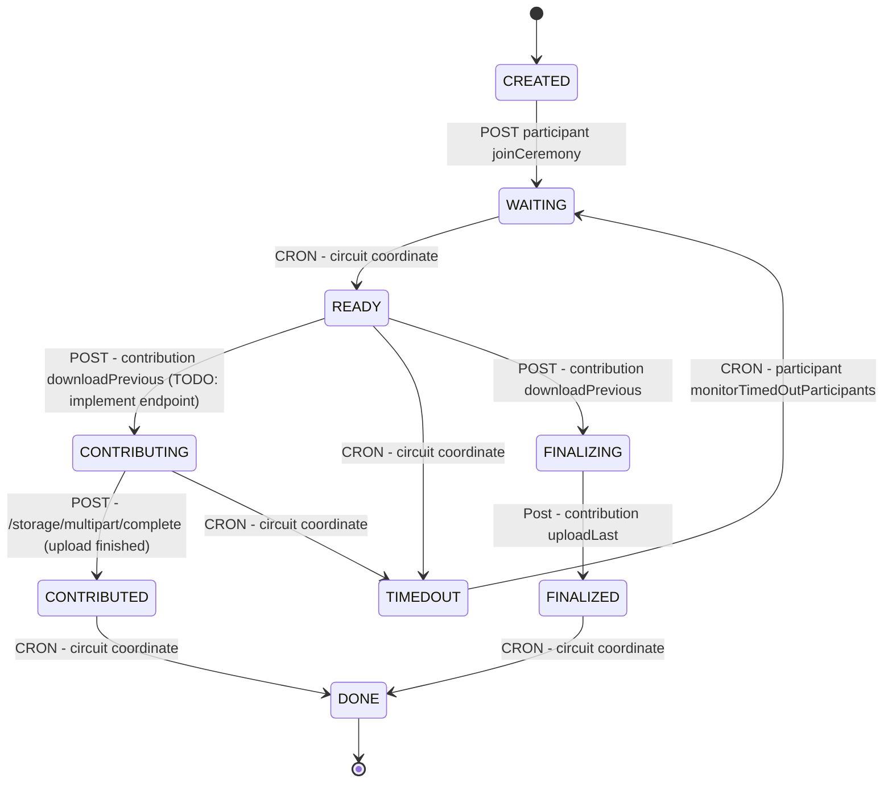

# p0tion backend service

## Description

A backend service built with [Nest](https://github.com/nestjs/nest) to facilitate running trusted setup ceremonies with the p0tion toolkit. This service should be up all the time for any project to submit their ceremonies, circuits and other configuration to run their ceremonies.

## Project setup

```bash
$ pnpm install

# IMPORTANT: If you are having problems with an error about sqlite binding files, run sqlite3 post script install

# Option 1 (recommended):
# Be sure to select the sqlite3 option in the interactive prompt before pressing enter
$ pnpm approve-builds

# Option 2
$ cd node_modules/sqlite3/ && pnpm rebuild & cd ../..
```

## Compile and run the project

```bash
# development
$ pnpm run start

# watch mode
$ pnpm run start:dev

# production mode
$ pnpm run start:prod
```

## Run tests

```bash
# unit tests
$ pnpm run test

# e2e tests
$ pnpm run test:e2e

# test coverage
$ pnpm run test:cov
```

## Deployment

When you're ready to deploy your NestJS application to production, there are some key steps you can take to ensure it runs as efficiently as possible. Check out the [deployment documentation](https://docs.nestjs.com/deployment) for more information.

If you are looking for a cloud-based platform to deploy your NestJS application, check out [Mau](https://mau.nestjs.com), our official platform for deploying NestJS applications on AWS. Mau makes deployment straightforward and fast, requiring just a few simple steps:

```bash
$ pnpm install -g @nestjs/mau
$ mau deploy
```

With Mau, you can deploy your application in just a few clicks, allowing you to focus on building features rather than managing infrastructure.

## Diagrams

### Participant state changes



## Load DBML (dbdiagram.io file) to the backend service

Remember that in order to keep track of the database schema, you should always add new changes to the `/src/database/diagram.dbml` file and then load it into the backend service (transform DBML to SQL, load SQL to the database using Sequelize and export the models as Typescript objects using sequelize-auto). To run all this automatically, you can use the following command:

```bash
$ pnpm run setup-dml-to-database
```

## Resources

Check out a few resources that may come in handy when working with NestJS:

- Visit the [NestJS Documentation](https://docs.nestjs.com) to learn more about the framework.
- For questions and support, please visit our [Discord channel](https://discord.gg/G7Qnnhy).
- To dive deeper and get more hands-on experience, check out our official video [courses](https://courses.nestjs.com/).
- Deploy your application to AWS with the help of [NestJS Mau](https://mau.nestjs.com) in just a few clicks.
- Visualize your application graph and interact with the NestJS application in real-time using [NestJS Devtools](https://devtools.nestjs.com).
- Need help with your project (part-time to full-time)? Check out our official [enterprise support](https://enterprise.nestjs.com).
- To stay in the loop and get updates, follow us on [X](https://x.com/nestframework) and [LinkedIn](https://linkedin.com/company/nestjs).
- Looking for a job, or have a job to offer? Check out our official [Jobs board](https://jobs.nestjs.com).

## Support

Nest is an MIT-licensed open source project. It can grow thanks to the sponsors and support by the amazing backers. If you'd like to join them, please [read more here](https://docs.nestjs.com/support).

## Stay in touch

- Author - [Kamil Myśliwiec](https://twitter.com/kammysliwiec)
- Website - [https://nestjs.com](https://nestjs.com/)
- Twitter - [@nestframework](https://twitter.com/nestframework)

## License

Nest is [MIT licensed](https://github.com/nestjs/nest/blob/master/LICENSE).
