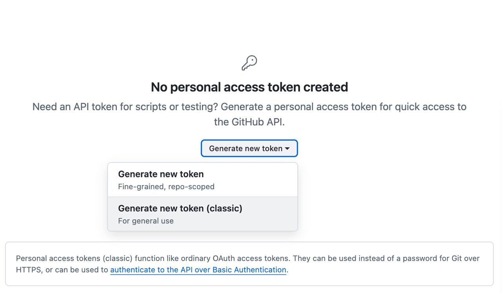
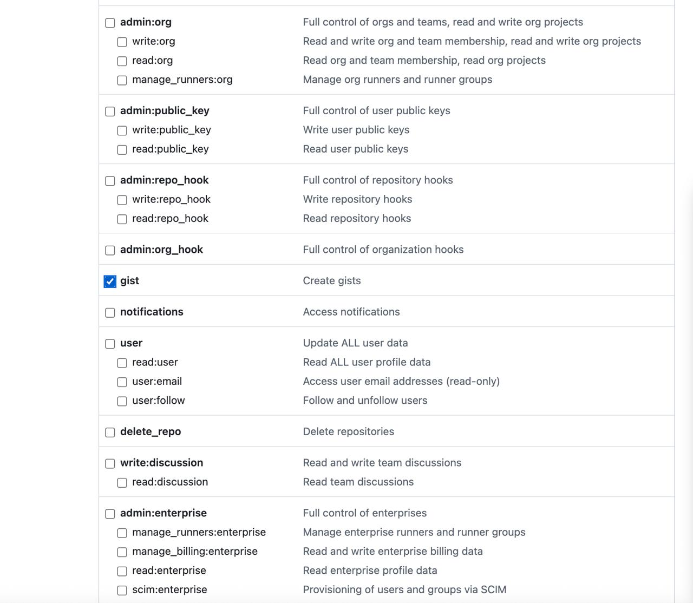

# Perpetual powers of tau ceremony on Cardano

## Introduction

**The perpetual powers of tau ceremony**

The perpetual powers of tau (also known as the phase-1 trusted setup) is a cryptographic prelude used to derive the proving and verification keys required by Zero-Knowledge protocols. The trusted setup is important for Cardano because it lays the secure foundations for running applications that rely on Zero-Knowledge proofs. In our journey of developing applications, we found that most robust ceremonies target elliptic curves different from those used by Cardano ( the bls12-381 elliptic curve). This ceremony will construct partial zk-SNARK parameters for circuits up to depth 2^24 using the BLS12-381 elliptic curve construction, which will be practically suitable for almost circuits available out there.

**How does it works?**

This ceremony is a multi-party computation process in which participants collectively generate these keys. Each contributor provides a secret input, ensuring that the final public parameters depend on randomness that no single participant fully controls. These secret inputs are private random values, which must be permanently discarded after use. Because they could compromise the system if leaked, they are often referred to as _toxic waste_. The security of the process relies on the guarantee that at least one contributor discards their toxic waste. If, however, all participants were to collude and retain their secrets, they could potentially subvert the system and produce valid but false Zero-Knowledge proofs. So, as we'll see later, make sure to erase your contribution, it is very important.

**Ceremony Workflow**

The **Perpetual Powers of Tau ceremony** is designed to generate public parameters that no single party controls, ensuring long-term security for Zero-Knowledge applications. The ceremony relies on two key roles: contributors and coordinators. Contributors inject private randomness into the multi-party computation, while coordinators manage the process by organizing contributions and verifying their correctness. The process unfolds as follows:

1. **Coordinator generates the initial challenge file**
   The ceremony begins with the coordinator producing an initial file, called the _challenge_. This file contains the starting parameters (the first set of powers of tau) that contributors will extend.

2. **Contributors add their secret randomness**
   Each contributor downloads the challenge file and mixes in their own private randomness. This randomness is combined with all previous contributions to extend the sequence of tau powers. The output is a new file, called the _response_, which includes the contributor’s randomness but hides the actual secret value.

   > ⚠️ At this stage, contributors must securely discard their private randomness (known as _toxic waste_). Keeping it would undermine the security of the system.

3. **Coordinator verifies contributions**
   After receiving each response, the coordinator verifies that the contribution was valid and correctly applied. This ensures that no one introduces malformed or malicious data that could break the setup.

4. **Final beacon application**
   Once all contributors have participated, the coordinator introduces an additional source of public randomness, called a _beacon_. Typically, this beacon is derived from a publicly verifiable and unpredictable source (such as block hashes, lottery results, or other randomness beacons). This step guarantees that even if every single contributor colluded, the beacon would still inject honest entropy into the system.

5. **Final verification and output**
   A last round of verification ensures that every contribution and the beacon have been correctly applied. The result is the **final trusted setup parameters** — a common reference string (CRS) that can be safely used by Zero-Knowledge proof systems.

**Ceremony coordination**

- **Ceremony coordination**:

  The coordination of the ceremony will be essential to ensure transparency and broad participation across the Cardano ecosystem.

- **Communication and social media**
  All announcements and updates will be shared through our official channels on Twitter/X, as well as a public GitHub repository. This will allow anyone interested to follow the progress in real time and access the resources needed to participate.

- **Registration form**
  A registration form will be published for participants to sign up as contributors. The form will request basic information (nickname, wallet address, technical background, and availability) to help organize the schedule and avoid overlaps.

- **Timeline**
  The ceremony will officially start on Q4 2025] and run for four weeks, with contribution slots assigned throughout this period. A detailed calendar will be made publicly available.

- **Contributors**
  Our goal is to reach at least 40 verified contributions. These will include: (a) Regular contributors, who will receive rewards in ADA after the ceremony is finalized; (b) Ad-honorem contributors, who will participate without financial rewards to further increase diversity and strengthen the contributor pool.

- **Rewards test transaction**
  Before distributing rewards, a test transaction on mainnet will be executed to verify the payment infrastructure and ensure that all participants can receive their compensation smoothly.

Regular reminders will be posted on social media, along with weekly progress updates, to keep the community informed and engaged.

# CLI Installation and Usage

## Hardware Requirements

To participate in the trusted setup, you will need a computer **with at least 16 GB of RAM and 10 GB of available storage**. Each challenge file is about 9GB, the contribution on a regular computer should take around 3 to 4 hours to generate the contribution.

## Prerequisites

⚠️ **Important**: The installation script will check for and potentially install the following dependencies on your local PC:

- Node.js (>= 22.17.1)
- pnpm (>= 9.0.0)
- wget (for downloading ceremony files)

> **If you already have these prerequisites installed, jump to [Installation Instructions](#installation-instructions).**

### Manual Installation (if needed)

**Node.js:**

- Download from [nodejs.org](https://nodejs.org/) (choose LTS version)
- Or use package manager: `sudo apt install nodejs` (Ubuntu) / `brew install node` (macOS)

**pnpm:**

```bash
npm install -g pnpm
```

**wget:**

- Ubuntu/Debian: `sudo apt-get install wget`
- macOS: `brew install wget`
- Windows: [Download from here](https://eternallybored.org/misc/wget/)

## Installation Instructions

### Clone the Repository

```bash
git clone https://github.com/NicoSerranoP/brebaje.git
cd brebaje
```

### Checkout on the CLI branch

```bash
git checkout feat/CLI
```

### Navigate to the CLI Folder

```bash
cd apps/cli
```

### Add Execution Permissions and Run Installation

```bash
chmod +x install.sh
./install.sh
```

The installation script will:

- ✅ Check for Node.js and pnpm dependencies
- ✅ Install missing dependencies if needed
- ✅ Configure pnpm global bin directory
- ✅ Install project dependencies
- ✅ Build the CLI
- ✅ Install the CLI globally
- ✅ Verify installation success

### Verify Installation

After successful installation, you should see the CLI help output. You can also test it manually:

```bash
brebaje-cli --help
```

## Configuration for Contribution

### Step 1: Fork the Ceremony Repository

Before creating tokens, you must fork the official ceremony repository to your GitHub account:

1. Go to the official ceremony repository (URL will be provided by coordinators)
2. Click the **"Fork"** button in the top-right corner
3. Select your GitHub account as the destination
4. Keep the repository **public** (required for token access)
5. Note your fork URL: `https://github.com/YOUR-USERNAME/ceremony-repo-name`

**Important**: You will use YOUR FORK URL in the setup commands, not the original repository URL.

### Step 2: Create GitHub Tokens

The CLI requires **two different GitHub tokens** for complete functionality:

#### Create Classic Token (For Gist Sharing)

To post contribution records publicly, you need a **GitHub classic personal access token**:



1. Go to [GitHub Settings > Developer settings > Personal access tokens > Tokens (classic)](https://github.com/settings/tokens)
2. Click "Generate new token (classic)" - **Make sure to select "classic" not "fine-grained"**
3. Give it a descriptive name (e.g., "Brebaje CLI - Powers of Tau")
4. Select the following permission:
   - ✅ **gist** (Create gists)
5. Click "Generate token"
6. **Important**: Copy the token immediately (you won't see it again)



#### Create Fine-grained Token (For Repository Operations)

To submit contribution records to the ceremony repository, you need a **GitHub fine-grained personal access token**:

1. Go to [GitHub Settings > Developer settings > Personal access tokens > Fine-grained tokens](https://github.com/settings/tokens?type=beta)
2. Click "Generate new token"
3. Give it a descriptive name (e.g., "Brebaje CLI - Repository Access")
4. Set expiration (recommend 90 days or custom)
5. **Resource access**: Select "Selected repositories" and choose YOUR FORKED ceremony repository
6. **Repository permissions**: Select the following:
   - ✅ **Contents**: Read and write
   - ✅ **Pull requests**: Read and write
7. Click "Generate token"
8. **Important**: Copy the token immediately (you won't see it again)

### Step 3: Configure CLI Setup

Configure all required settings using the setup commands:

```bash
# Set your full name for contribution records
brebaje-cli setup name "Your Full Name"

# Set your forked ceremony repository URL
brebaje-cli setup ceremony-repo https://github.com/YOUR-USERNAME/ceremony-repo-name

# Configure GitHub classic token for gist sharing
brebaje-cli setup gh-token ghp_your_classic_token_here

# Configure fine-grained token for repository operations
brebaje-cli setup gh-token-scoped github_pat_your_fine_grained_token_here
```

Replace the placeholders with your actual values:

- `YOUR-USERNAME`: Your GitHub username
- `ceremony-repo-name`: The actual ceremony repository name
- `ghp_your_classic_token_here`: Your GitHub classic token
- `github_pat_your_fine_grained_token_here`: Your GitHub fine-grained token

### Receive Ceremony URLs from Coordinator

The ceremony coordinator will provide you with a JSON file containing the download and upload URLs. This file will look like:

```json
{
  "download_info": {
    "field_name": "pot12_0005.ptau",
    "s3_key_field": "Cardano-PPOT/pot12_0005.ptau",
    "expiration": "2025-10-02T19:59:05.861Z",
    "download_url": "https://s3.amazonaws.com/bucket/challenge.ptau?..."
  },
  "upload_info": {
    "field_name": "pot12_0006.ptau",
    "s3_key_field": "Cardano-PPOT/pot12_0006.ptau",
    "expiration": "2025-10-01T20:59:05.861Z",
    "upload_url": "https://s3.amazonaws.com/bucket/contribution.ptau?..."
  }
}
```

**Place this JSON file in the `input/` folder** or keep it accessible with a known path.

## Contributing to a Ceremony

Once you have the JSON file from the coordinator, you can contribute in two ways:

### Automatic Contribution (Recommended)

If you placed the JSON file in the `input/` folder:

```bash
brebaje-cli ppot auto-contribute
```

If the JSON file is elsewhere:

```bash
brebaje-cli ppot auto-contribute /path/to/ceremony-urls.json
```

This command will automatically:

1. 📥 Download the challenge file
2. 🔧 Make your contribution
3. 📤 Upload your contribution
4. 📋 Post your contribution record to GitHub Gist and ceremony repository
5. 🔗 Generate pull request links for official submission

### Complete Your Contribution Submission

**CRITICAL**: After the auto-contribute command completes, you MUST open the generated links to finalize your contribution:

1. **Open the Pull Request Link**: The CLI will display a pull request URL like:
   ```
   🔄 Create pull request:
   https://github.com/original-ceremony-repo/compare/main...your-username:main?expand=1&title=...
   ```
2. **Click "Create pull request"** on the GitHub page to officially submit your contribution to the ceremony

3. **Share on Social Media**: Click the generated Twitter/X link to share your participation with the Cardano community

**Your contribution is NOT complete until you create the pull request!**

### Manual Step-by-Step Process

1. **Download challenge file:**

   ```bash
   brebaje-cli ppot download "https://download-url-from-json..."
   ```

2. **Make contribution:**

   ```bash
   brebaje-cli ppot contribute
   ```

3. **Upload contribution:**

   ```bash
   brebaje-cli ppot upload "https://upload-url-from-json..."
   ```

4. **Post contribution record:**

   ```bash
   brebaje-cli ppot post-record
   ```

5. **Complete submission by opening generated links:**
   - Open the pull request URL displayed in the terminal
   - Click "Create pull request" on GitHub to submit officially
   - Share your contribution using the provided Twitter/X link

## File Structure After Contribution

After contributing, you'll have:

```
apps/cli/
├── input/               # Challenge files downloaded here
│   └── pot12_0005.ptau
├── output/              # Your contributions saved here
│   ├── pot12_0006.ptau
│   └── pot12_0006_record.txt
├── .env                 # Your configuration (keep private!)
└── ceremony-urls.json   # URLs file from coordinator
```

**What gets submitted to GitHub:**

- **Gist**: Public sharing link with your contribution record
- **Repository**: Official folder in your forked ceremony repo containing:
  - `pot12_0006_record.txt` - Your contribution record
  - `response_resume.md` - Contribution metadata and hardware info
- **Pull Request**: Official submission from your fork to the original ceremony repository

## Troubleshooting

### CLI Not Found in PATH

If you see "command not found" after installation:

```bash
# For bash users:
echo 'export PATH="$HOME/.local/bin:$PATH"' >> ~/.bashrc
source ~/.bashrc

# For zsh users:
echo 'export PATH="$HOME/.local/bin:$PATH"' >> ~/.zshrc
source ~/.zshrc
```

### Permission Issues

If you encounter permission errors:

```bash
chmod +x install.sh
```

### pnpm Configuration Issues

If pnpm global commands don't work:

```bash
pnpm config set global-bin-dir ~/.local/bin
mkdir -p ~/.local/bin
```

## Security Notes

- 🔒 Keep your GitHub token secure and private
- 🗑️ The `input/` folder can be deleted after contribution
- 💾 Keep the `output/` folder as proof of your contribution
- ⏰ URLs in the JSON file have expiration times

## Getting Help

For additional help and available commands:

```bash
brebaje-cli --help
brebaje-cli ppot --help
```

## Support

If you encounter issues:

1. Check this documentation first
2. Verify all prerequisites are installed
3. Contact the ceremony coordinator
4. Report bugs at the project repository

---

**Happy contributing to the Powers of Tau ceremony! 🎉**

# What's Next?

We deeply appreciate your participation in this ceremony — your contribution plays an important role in strengthening the Cardano ecosystem! <3

The final results of the ceremony will be published in our official GitHub repository. There, we will also share the list of contributors and all relevant data related to the process.

## Rewards

Rewards will be distributed once the ceremony is completed and has passed approval from the Catalyst team. After that, we will announce the official date for rewards distribution.

---

# Appendix

**Look for a good entropy source**

To make the contribution you must make a random value that is hard to replicate. Now there are a couple random source you can choose:

1. **Randomly typing**

The must obvious is to type a random string of characters using your keyword and creativity.

2. **Using Cardano blocks**

You can add the Cardano block hashes as an input. You can check the hashes of the blocks on a Cardano explorer like [cardano scan](https://cardanoscan.io/blocks)

3. **Using the urandom device from Linux**

To read some values the `urandom` device you can use this command:

```bash
xxd -p -l 256 /dev/urandom
```

It will display a long string random hexadecimals generated by the linux kernel.

## FAQ

- **What will be the benefit for Cardano from this ceremony?**

This ceremony enables the secure operation of applications that rely on Zero-Knowledge proofs. Without completing this setup, such applications would face weaker security guarantees, limiting their robustness and trustworthiness.

- **What happens if I don't discard my toxic waste?**

In the context of a trusted setup, **toxic waste** refers to the private randomness that each contributor generates when making their contribution. This value must be permanently discarded after your participation. Failing to do so can compromise the security of the entire ceremony. Mallicious users could create valid but false proof, breaking the security garantees of a Zero-Knowledge protocol.

- **Why is the ceremony is not fully permisionless?**

We decided to run this ceremony in a more **permissioned** way because previous open ceremonies have faced several challenges such as spam and sybil attacks. Implement a permisionless registration system is a complex task that doesn't provide sufficient garantees to solve these problem. In sum, our rationale was to make the process simpler and rely on trusted actors of the Cardano ecosystem such as stake pool operators, developers and other important figures; although permissioned, the ceremony remains transparent: every valid contribution will be publicly auditable, ensuring that the final output is trustworthy.
