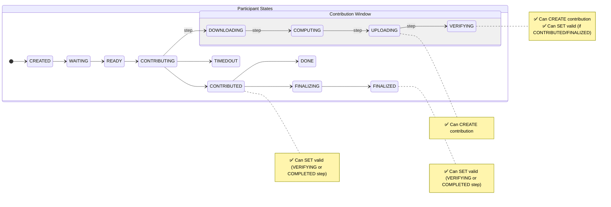

# Contribution Lifecycle Transitions

This document describes the legal state transitions enforced by the contributions service when creating or updating contribution records. The rules align with the [p0tion](https://github.com/privacy-ethereum/p0tion) Phase 2 Trusted Setup ceremony flow.

## State Machine

## Legal Transitions

### Create Contribution

A contribution record can only be created when the owning participant satisfies **both** conditions:

| Participant Status | Contribution Step |
| ------------------ | ----------------- |
| `CONTRIBUTING`     | `UPLOADING`       |
| `CONTRIBUTING`     | `VERIFYING`       |

**Rationale:** In the p0tion flow, a contribution document is created when the participant is the current contributor and has produced a zKey (upload phase) or verification has started. Earlier steps (`DOWNLOADING`, `COMPUTING`) mean no zKey exists yet; other statuses mean the contribution window has passed.

Any other combination is rejected with:

> Contribution can only be created when participant is CONTRIBUTING in UPLOADING or VERIFYING step

### Update Contribution — Setting `valid`

The `valid` field (verification result) can only be set when the owning participant satisfies **both** conditions:

| Participant Status           | Contribution Step |
| ---------------------------- | ----------------- |
| `CONTRIBUTED` or `FINALIZED` | `VERIFYING`       |
| `CONTRIBUTED` or `FINALIZED` | `COMPLETED`       |

**Rationale:** Verification results are recorded after the participant has contributed and the verification process is running or has completed.

Any other combination is rejected with:

> Contribution validity can only be set when participant is CONTRIBUTED or FINALIZED in VERIFYING or COMPLETED step

### Update Contribution — Other Fields

Fields other than `valid` (timing data, files, verification software metadata, etc.) can be updated without lifecycle checks, subject to existing authentication and authorization guards.

### Delete Contribution

No lifecycle transition check is applied. Deletion is restricted to ceremony coordinators via the `IsContributionCoordinatorGuard`.

## Idempotency

Repeated calls must not corrupt state:

- **Create:** The existing "valid contribution already exists" check prevents duplicate _valid_ contributions for the same `(circuitId, participantId)`. Multiple rows (e.g. one invalid, one valid) are allowed by schema.
- **Update `valid`:** If the contribution already has the same `valid` value as the incoming update, the service treats it as a no-op (idempotent). No participant state check is performed in this case, and the update proceeds harmlessly. This prevents flip-flopping or errors on retries.

## Enforcement

- **Transition rules** are defined in `apps/backend/src/contributions/contribution-transitions.ts` via `canCreateContribution()` and `canSetContributionValidity()` helper functions.
- **Service enforcement** is in `apps/backend/src/contributions/contributions.service.ts` — the `create()` and `update()` methods call the transition helpers and throw `BadRequestException` on illegal transitions.
- **Tests** cover all allowed and disallowed `(status, step)` combinations in `contribution-transitions.spec.ts` and `contributions.service.spec.ts`.
